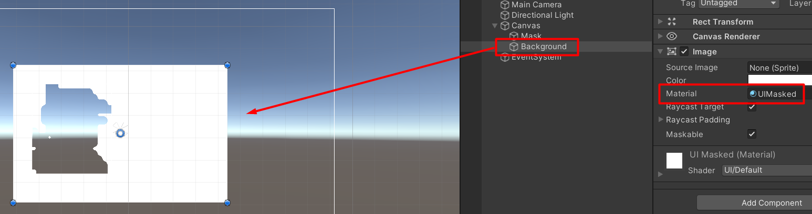
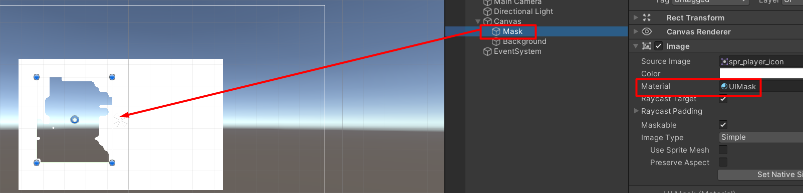

## How to Use?

1. Add this package through package manager
1. Duplicate the Material from the packages folder (Ctrl + C)

1. Paste it anywhere within your project folder (Ctrl + V)

1. The background need to use `UIMasked`

1. The Mask need to use `UIMask`

1. The mask must be placed on the upper of the hierarchy of the background
`

